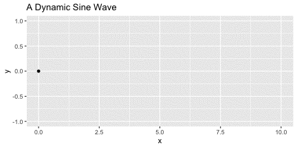

I recently tried out the [gganimate](https://doi.org/10.1101/206052) R package and made some simple dynamic plots. Today I want to try out two other packages; [gifski](https://CRAN.R-project.org/package=gifski) and [magick](https://cran.r-project.org/package=magick), to see how easy it is to export some simple GIFs. It looks like magick can do *a lot* of image processing tasks, while gifski is pretty focused on the one task: images > GIF.

## Load some R packages
```{r setup, include=FALSE}
knitr::opts_chunk$set(collapse = TRUE, out.width = "100%")
```
```{r, load-packages, message=FALSE, warning=FALSE}
library(tidyverse)
library(gifski)
library(magick)
```

## Static sine wave
We will create a static plot first:
```{r static-sine-wave, message=FALSE, warning=FALSE, fig.width=6, fig.height=3, dpi=72}
ggplot(data = tibble(x=seq(0,10,0.1), y=sin(seq(0,10,0.1))),
       aes(x=x, y=y)) +
  geom_point() +
  ggtitle(" A Static Sine Wave")
```


## gifski
Now we will try create a dynamic version with gifksi:
```{r gifski-dynamic-sine-one, eval=FALSE}
plot_sine <- function(i) {
  p <- ggplot(data = data.frame(x=i,y=sin(i)), aes(x=x, y=y)) + 
    geom_point() + 
    ylim(c(-1,1)) +
    xlim(c(0,10)) +
    ggtitle("A Dynamic Sine Wave")
  print(p)
  }

save_gif(expr = pwalk(list(seq(0,10,0.1)), plot_sine),
         gif_file = "gifski_sine_wave.gif",
         width = 72*6, height = 72*3, res=72,
         delay = 0.1, loop = TRUE, progress = FALSE)
```


## magick
Now we'll try the same with :tophat::rabbit2::
```{r magick-sine, eval=FALSE}
# Make a directory to save png images in
dir.create("sine_wave_images")

# Create images
walk(1:101, function(i) ggsave(filename = str_glue('sine_wave_images/{str_pad(i,3,"left","0")}.png'),
                              plot = plot_sine(seq(0,10,0.1)[i]),
                              width = 6,height = 3, units = "in", dpi=72))

# Read in images, stitch them together, animate and write out
lapply(list.files("sine_wave_images/", full.names = TRUE),
       image_read) %>% 
  image_join() %>%
  image_animate(fps = 10) %>%
  image_write(path = "magick_sine_wave.gif")
```



## File sizes
Check the size of each GIF file:
`utils:::format.object_size(file.size("gifski_sine_wave.gif"), units = "auto")`

139.5 Kb

`utils:::format.object_size(file.size("magick_sine_wave.gif"), units = "auto")`

1.6 Mb

The magick gif is ~10 times larger ... I'm not sure why. gifski has another function `save_gif`. Let's try use that function to create a GIF using the same images we used with magick, then check the file size.

## gifski::save_gif()
Using the same png files:
```{r gifski-dynamic-sine-two, eval=FALSE}
gifski(png_files = list.files("sine_wave_images/", full.names = TRUE),
       gif_file = "gifski_sine_wave2.gif", 
       width = 72*6, height = 72*3,
       delay = 0.1, loop = TRUE, progress = TRUE)

# Remove individual images now we have our gifs
unlink("sine_wave_images/", recursive = TRUE)
```


Check the size of the new GIF
`utils:::format.object_size(file.size("gifski_sine_wave2.gif"), units = "auto")`

139.5 Kb

It's the same size :shrug:. There's probably some magick options we could tweak to reduce the file size, but since this was just for fun I'll leave it there for now.
